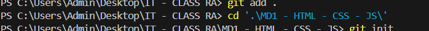

##Các thẻ HTML cơ bản 
H1-H6: Heading 
p: Đoạn văn 
Image: thẻ ảnh 
button: nút bấm 
a: thẻ liên kết 
table: bảng 
input: để hiển thị ô input đẻ nhập thông tin văn bản 
ol - li: Danh sách sắp xếp có thứ tự 
ul-li: Danh sách sắp xếp không thứ tự, có dấu chấm đầu dòng 
tr-td: Thiết kế bảng 
div: tạo khối 
footer: thẻ đánh dấu phần cuối của trang web (Thông tin liên hệ)
header: Thẻ đánh dấu phần đầu của trang web (Thông tin, liên kết các trang khác nhau)
body: Thẻ đánh dấu phần thân website
##GifHub
+ Git history: Check lại lịch sử 
+ git init: Khởi tạo ra 1 kho cho project ở Local (chính trên máy của chúng ta)
+ git status: 
+ git add file_name: Thêm sự thay đổi của file_name vào kho local 
+ git add . : Thêm tất cả các file có sự thay đổi vào file local 
+ git commit -m "Your commment": Thêm comment cho sự thay đổi vào kho local 
+ git remote add origin your_url: Thêm liên kết giữa kho local và kho server (github) 
+ git push origin branch_name: Đẩy code từ kho local lên kho server 
